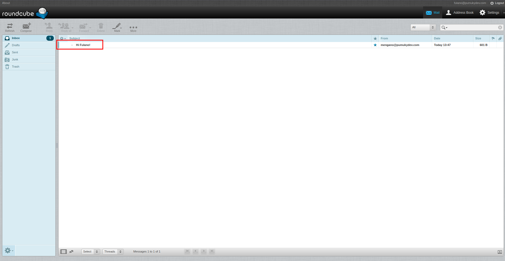
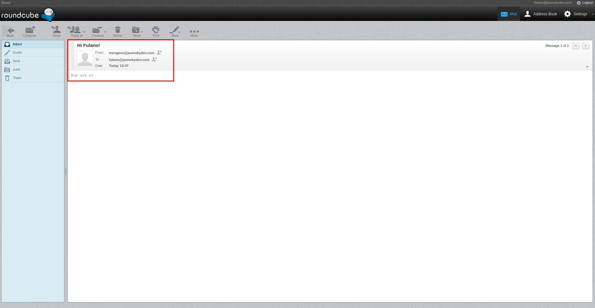

<h1 align="center">Roundcube</h1>

**Roundcube** is an open-source webmail client that allows users to manage emails directly from a web browser. It supports **IMAP** and **SMTP** protocols and offers a modern and user-friendly interface to send, receive, and organize email messages.

## Prerequisites

Make sure you have the following installed on your system:

- [Docker](https://www.docker.com/)
- [Docker Compose](https://docs.docker.com/compose/)

## Installation

Clone the repository:

```bash
git clone https://github.com/PumukyDev/roundcube.git
```

Navigate to the Roundcube directory:

```bash
cd roundcube
```

Deploy the containers:

```bash
docker-compose up -d --build
```

Once the containers are up, open your browser and navigate to:

```
http://192.168.10.3/roundcubemail/
```

## Test Users

You can use the following virtual accounts to test email functionality:

| Username                  | Password  |
|---------------------------|-----------|
| mengano@pumukydev.com     | mengano12 |
| fulano@pumukydev.com      | fulano12  |


## How to Use

### 1. Log in as Mengano


### 2. Click on "Compose"


### 3. Write and send a message to Fulano


### 4. Log out and log in as Fulano


### 5. Check the inbox



### 6. Open the message

