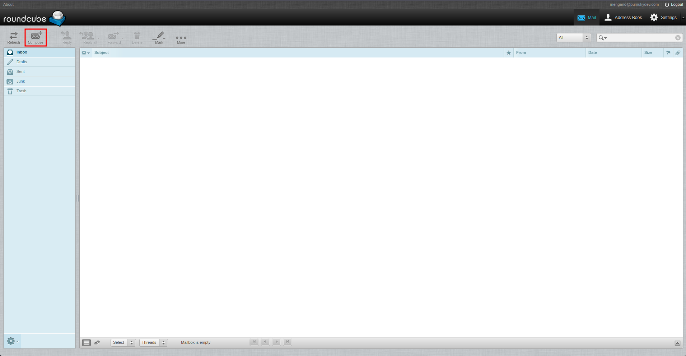

# Roundcube


Roundcube is an open-source webmail client that allows users to manage emails via a web browser. It supports IMAP and SMTP protocols, offering a user-friendly interface for organizing, sending, and receiving emails.

## How to use it

Clone the repository:

```bash
git clone https://github.com/PumukyDev/roundcube.git
```

Navigate to the Roundcube folder:

```bash
cd roundcube
```

Deploy the containers with Docker:

```bash
docker-compose up -d --build
```

Then, open your browser and go to `http://192.168.10.3/roundcubemail/` (this is the IP address of the Roundcube container).

On the login screen, sign in using the virtual user "Mengano".


Once logged in, click the "Compose" button to write a new email.



Send the email to "Fulano".


After sending the email, log in as "Fulano" to check the inbox.


As we can see, the email has been successfully delivered.


The email has been correctly received.


